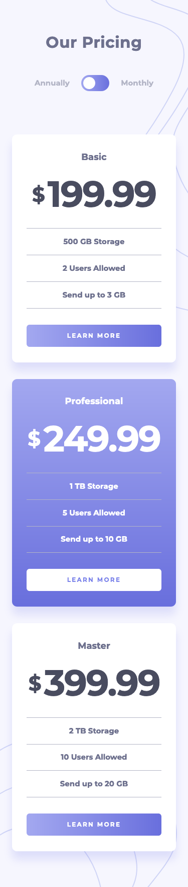
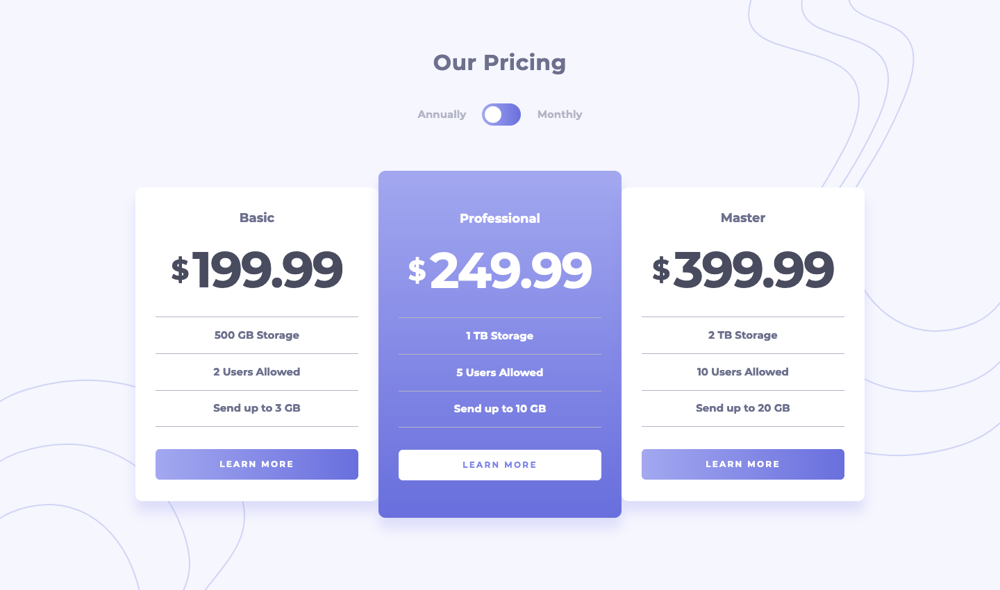

# Frontend Mentor - Pricing Component with Toggle solution
This is a solution to the [Pricing Component with Toggle challenge on Frontend Mentor](https://www.frontendmentor.io/challenges/pricing-component-with-toggle-8vPwRMIC). Frontend Mentor challenges help you improve your coding skills by building realistic projects. 

### The challenge
Users should be able to:
- View the optimal layout for the component depending on their device's screen size
- Control the toggle with both their mouse/trackpad and their keyboard

## Screenshot

### Mobile


### Desktop


## Built with
- Semantic HTML5 markup
- CSS custom properties
- Flexbox
- Mobile-first workflow
- JavaScript

## What I learned

I had some difficulty deciding what to do with the toggle with respect to accessibility. I wanted 'Annually' and 'Monthly' to be clickable as well as the toggle itself. I decided to make 'Annually' and 'Monthly' the labels of radio button inputs and the radio button inputs themselves visually hidden. Radio button inputs have accessibility built-in to them so I felt this was the correct choice, although it led to some complications in the CSS and JS code.

The toggle is clickable and has a hover state, however I added `aria-hidden="true"` to hide it from screen readers as they will be able to change the payment frequency using the radio buttons. The toggle is also not accessible via the keyboard for the same reason.

Although it wasn't specified in the challenge, I wanted to have a go at creating a custom scrollbar:
```css
body::-webkit-scrollbar { width: 1rem; }

body::-webkit-scrollbar-track {
    border-radius: var(--br-pill);
    margin-block: .125rem;
    background: var(--clr-white);
}

body::-webkit-scrollbar-thumb {
    border: .2rem solid transparent;
    border-radius: var(--br-pill);
    background: var(--clr-gray) content-box;
}
```

## Continued development

I am continuing to complete the challenges on Frontend Mentor. I find that with each challenge there is always a new problem to solve (in this challenge it was the toggle). Meanwhile I am working through the modules on freeCodeCamp and completing puzzles on Code Wars to improve my understanding of JavaScript.

My first experience of using Bootstrap wasn't positive, so I am going to give it another shot soon!

## Useful resources

- [Custom Scrollbar Tutorial](https://www.youtube.com/watch?v=lvKK2fs6h4I) - This tutorial helped me create the custom scrollbar.